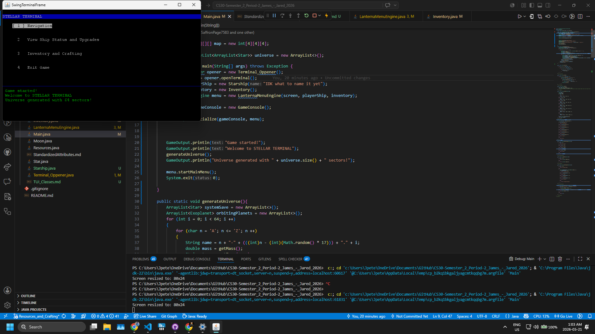
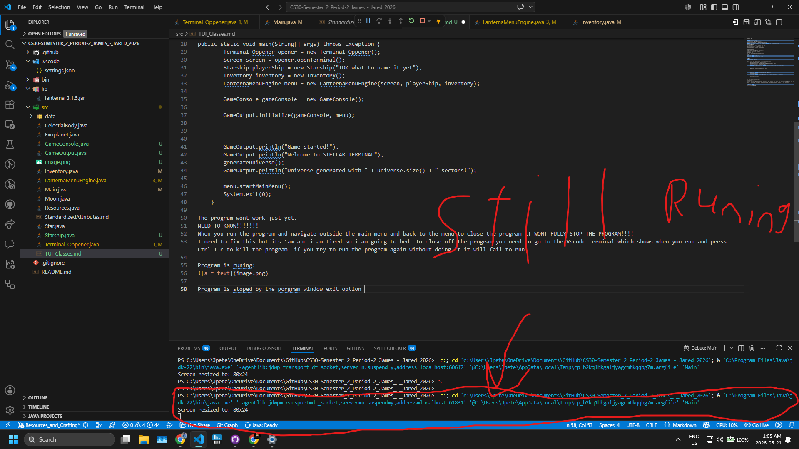

Terminal TUI

LanternaMenuEngine.java
Shows menus and highlights options.
Lets you move with arrow keys or numbers.
Shows a “console” area at the bottom for messages.
DONT USE with System.out.print use GameOutput.println() tp print in all files
Important Methods:
startMainMenu() -> starts the main menu loop
openShipStatusMenu() -> opens ship menu
openInventoryMenu() -> opens inventory menu
openCraftingMenu() -> opens crafting menu

GameConsole.java
Keeps track of messages for the console.
Shows only the last 20 messages.
Output passed to LanternaMenuEngine for rendering of text.

GameOutput.java
Use this to print messages to the console.
Like:
GameOutput.println("Copper");
GameOutput.println("Ship HP: 100 of 100");

In Main:
dont change the order of: 

public static void main(String[] args) throws Exception {
        Terminal_Oppener opener = new Terminal_Oppener();
        Screen screen = opener.openTerminal();
        Starship playerShip = new Starship("IDK what to name it yet");
        Inventory inventory = new Inventory();
        LanternaMenuEngine menu = new LanternaMenuEngine(screen, playerShip, inventory);
        
        GameConsole gameConsole = new GameConsole();
        
        GameOutput.initialize(gameConsole, menu);

        
        
        GameOutput.println("Game started!");
        GameOutput.println("Welcome to STELLAR TERMINAL");
        generateUniverse();
        GameOutput.println("Universe generated with " + universe.size() + " sectors!");
        
        menu.startMainMenu();
        System.exit(0);
    }

The program wont work just yet. 
NEED TO KNOW!!!!!!!
When you run the program and navigate outside the main menu and back to the menu to close the program IT WONT FULLY STOP THE PROGRAM!!!!
I need to fix this but its 1am and i am tired so i am going to bed. To close off the program you need to go to the Vscode terminal which shows when you run and press Ctrl + c to kill the program. if you try to run the program again without doing it it will fail to run.

click on the underline image name to see the linked image. 
Program is ruining:

Program is stoped by the program window exit option 
 

Click on the terminal and press Ctrl + c to kill the program. Then you can run the program again. Just to note you can see the in the top of the image that the java debuger is still runing. somtimes it disapires when you exit from the program window without the use of Ctrl + c. You still need to do it. 